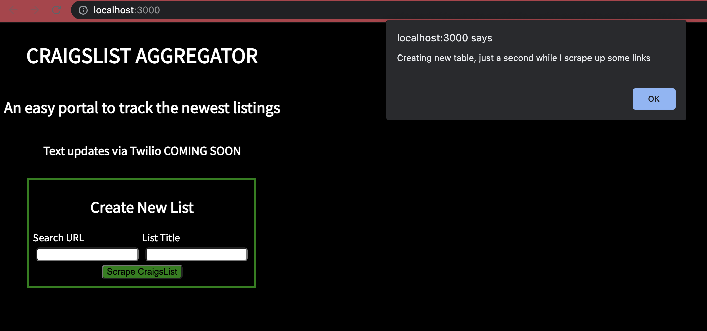
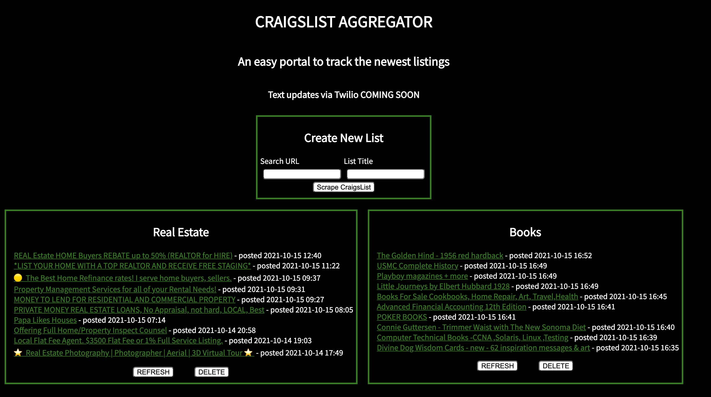

# ScrapeBot

Web Scraper and link aggregator for CraigsList

## Overview

Front-end designed in React accepts a CraigsList link (filtered to desired specificity). Back-end designed in Node.js runs Puppeteer to scrape listings, populates a Postgres database, and uses Express with to serve data to client.

## Installation

Requires Node and Postgres

`npm install` installs node packages

`npm run database` creates primary table (connected to port 5432, or change configuration in database/index.js)

`npm run build` transpiles jsx files to js files

`npm run server` runs server on localhost:3000

